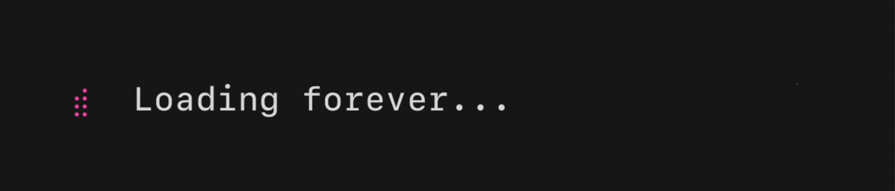

# go-boba

This project contains a Go Bubble Tea application and `vhs` demos.

## Testing and Linting

To ensure code quality, run this custom script after any successful `go test`s:

```bash
./golint.sh
```


<!-- DO NOT EDIT BELOW THIS LINE -->
## Demos

#### demo.gif


